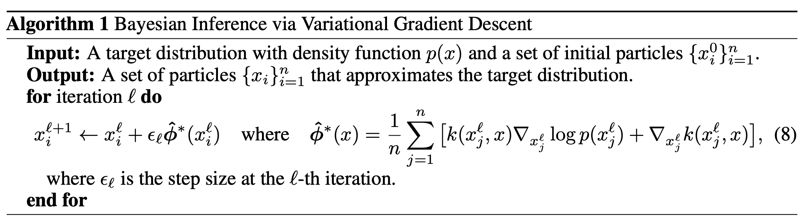

# Stein Variational Gradient Descent



# Simulation

target distribution

```py
A = np.array([[0.2260, 0.1652], [0.1652, 0.6779]])
mu = np.array([-4, 3])
```

initial distribution

```py
x0 = np.random.normal(7, 7, [100, 2])
```


```bash
ground truth:  [-4  3]
svgd:  [-3.90359892  3.03488806]
```
